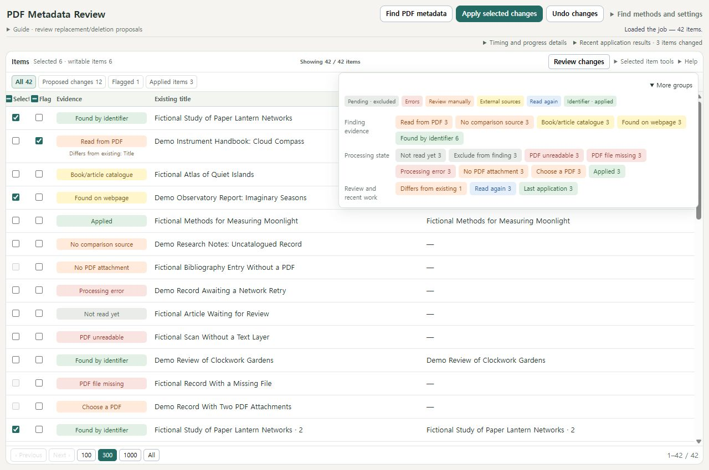
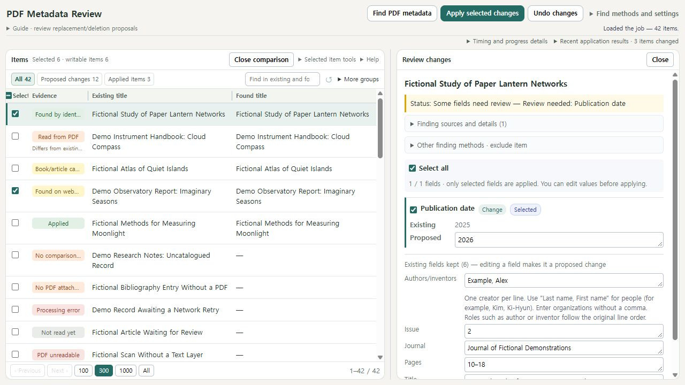
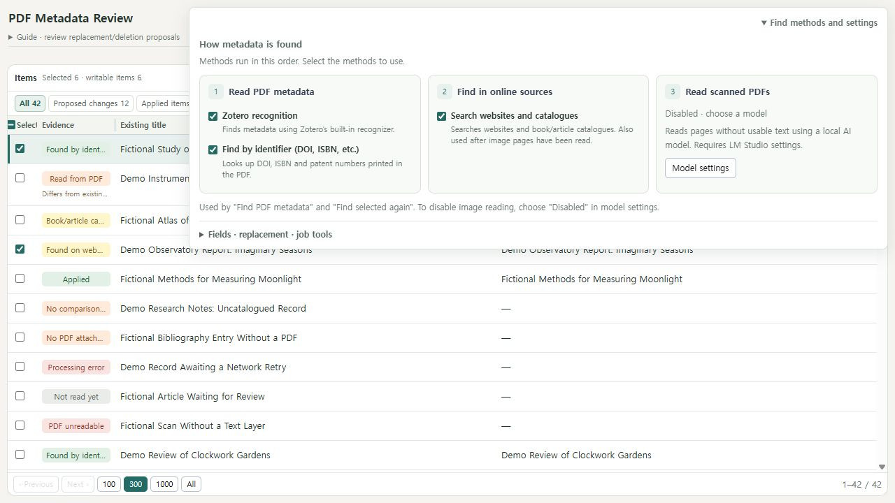

#  PDF Metadata Refresh

Review and refresh the metadata of PDFs already in your Zotero library. Compare proposed changes field by field, check how information was found, and apply the fields you choose while keeping attachments, notes and annotations connected.

[한국어](docs/README.ko.md) · [User guide](docs/USER-GUIDE.md) · [Privacy](docs/PRIVACY.md) · [Version 1.0.1](docs/RELEASE-NOTES-1.0.1.md)



Every document, author and identifier in these screenshots is fictional. The screenshots show the actual add-on UI; no personal library was used.

## Install

1. Download **pdf-metadata-refresh-1.0.1.xpi** from [Releases](https://github.com/git-jiwon/zotero-pdf-metadata-refresh/releases).
2. In Zotero, open **Tools → Plugins** and drag the XPI into the plugin window, or choose **Install Plugin From File** from its menu.
3. Select items with PDF attachments in your library. Right-click and choose **Find title and author metadata from PDFs…**.

Version 1.0.1 declares compatibility with **Zotero 10.0.1–10.0.x**. PDF page rendering for LM Studio image reading currently requires Windows. The interface uses Korean when Zotero's language is Korean and English for other languages. Your document titles and metadata stay in their original language.

See [Zotero's plugin installation instructions](https://www.zotero.org/support/plugins).

## Find → review → apply

1. Choose **Find PDF metadata**. Finding information creates proposals without changing the existing Zotero values.
2. Click an item to compare its current information with the proposal. Select the fields and items you want to apply.
3. Choose **Apply selected changes** and review the confirmation. Selected items hidden by a filter can also be included.

The compact toolbar keeps more space available for the item list and comparison panel. Finding methods, detailed groups and tools open when needed; click outside or press Escape to close them. Click the **Evidence** column to group identical tags together. Drag its right edge to adjust the column width, or focus the resize handle and use the arrow keys.

| Colour | What to check |
| --- | --- |
| Grey | Pending, stopped or excluded items |
| Red | A reading, file or processing error |
| Orange | PDF reading, missing information or an attachment choice needing review |
| Yellow | Catalogue or webpage results needing review |
| Blue | Rescan history |
| Green | Identifier-based information or a recorded application |

Detailed groups and evidence badges use the same colours. Groups and evidence sorting follow grey → red → orange → yellow → blue → green. Colour shows the kind of result and review priority; it does not certify correctness or approve a change.



**Review deletion proposals as well.** The default mode uses the found PDF information as the basis for a proposal. Existing fields or authors absent from the result can be proposed for removal. Proposals keep the settings used when they were created.

Saved jobs let you continue a review later. **Export selected items…** saves a JSON report of the checked items, including selections hidden by the current filter. Exporting does not apply metadata. Apply history records the fields actually written; undo compares retained records with the current item before restoring them. See the [user guide](docs/USER-GUIDE.md) for limitations and examples.

## Finding methods

The add-on can use Zotero's PDF recognizer, DOI/ISBN information, catalogue and web lookup, and optional local LM Studio image reading. Open **Find methods and settings** to choose the methods you need. LM Studio requires a running local server and a suitable loaded model.



Zotero recognition and external lookups can send extracted text, identifiers, titles or query fragments to their services. LM Studio page images go to the configured loopback server. Jobs, recognition caches and OCR records are stored in the Zotero data directory and can contain document information. See [Privacy](docs/PRIVACY.md) and [Security](SECURITY.md) before sharing reports or diagnostics.

## Build and contribute

Use **Node.js 24**. This public repository contains only the reviewed release source, synthetic public tests and fictional screenshots.

```sh
npm ci --ignore-scripts
npm run typecheck
npm run test:public
npm audit --audit-level=moderate
npm run build:release
npm run release:check
```

The release checker validates the allowed source files, screenshot metadata, distribution settings and the current XPI checksum in `updates.json`. Release XPIs contain only the runtime files and two icon sizes, without source maps. See [GitHub publishing information](docs/GITHUB-PUBLISHING.md) for the release workflow and ready-to-use repository description.

Tests verify synthetic cases and safeguards; they do not measure real-world recognition accuracy or model quality. Report bugs through [Issues](https://github.com/git-jiwon/zotero-pdf-metadata-refresh/issues) using fictional or redacted examples. Follow [SECURITY.md](SECURITY.md) for vulnerabilities.

See [LICENSE](LICENSE) for distribution and reuse terms.
