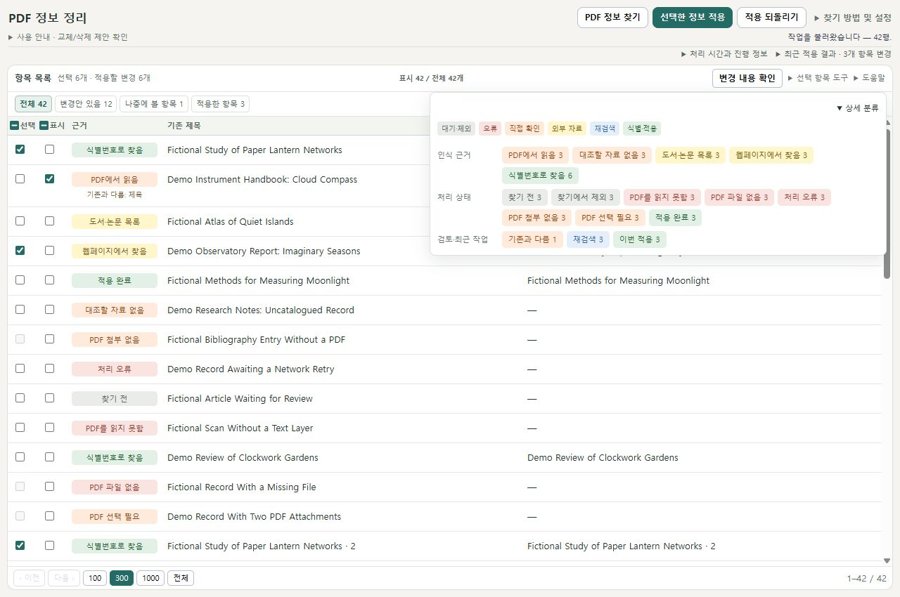
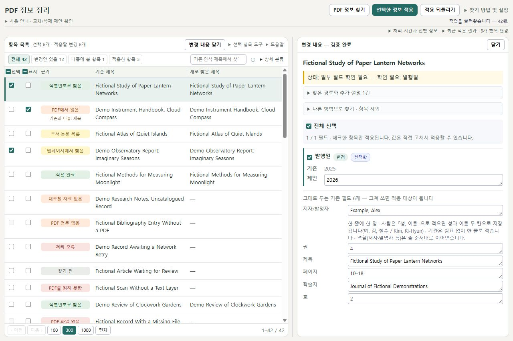
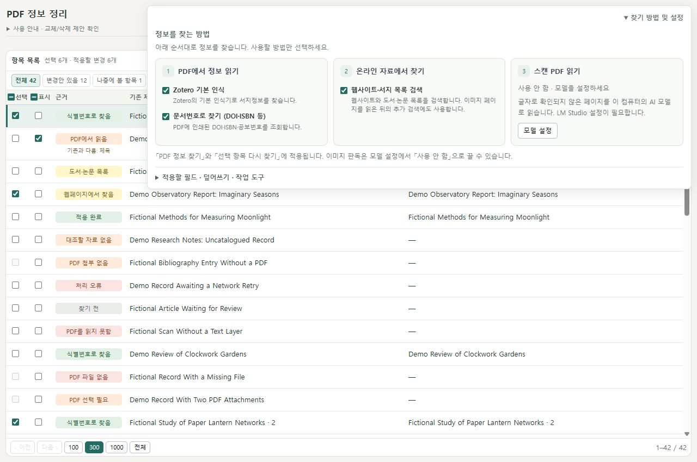

# PDF Metadata Refresh

[English](../README.md) · [v1.0.0 다운로드](https://github.com/git-jiwon/zotero-pdf-metadata-refresh/releases/tag/v1.0.0) · [사용 안내](USER-GUIDE.ko.md)

Zotero에 이미 들어 있는 PDF의 제목·저자·발행 정보를 다시 찾아 **기존 정보와 비교한 뒤 선택해서 적용**하는 플러그인입니다. PDF 첨부파일, 노트와 주석의 연결을 유지하면서 항목별·필드별 변경안을 검토할 수 있습니다.

이 저장소는 첫 공개 버전 **1.0.0**의 소스와 안내만 담습니다. 스크린샷의 문서 제목·저자·서지정보는 모두 가상 예시이며 개인 라이브러리 자료를 사용하지 않았습니다.



## 주요 기능

- **찾고 비교한 뒤 적용:** 정보 찾기는 변경 제안만 만듭니다. 적용 버튼과 확인창을 거쳐야 Zotero의 값이 바뀝니다.
- **항목과 필드별 검토:** 기존 값, 새 값과 삭제 제안을 비교하고, 사용할 정보를 선택하거나 직접 수정할 수 있습니다.
- **여러 인식 경로:** Zotero 기본 PDF 인식, DOI·ISBN 등의 식별자 조회, 웹·서지 목록 검색과 선택적인 로컬 LM Studio 이미지 판독을 사용합니다.
- **읽기 쉬운 목록:** 제목 검색, 간단한 필터, 같은 근거끼리 정렬, 변경 비교와 진행 상태를 제공합니다.
- **작업 이어보기와 복구:** 저장된 작업을 이어 보고 적용 기록을 확인하거나 적용 전 값으로 되돌릴 수 있습니다. 적용 뒤 수동 편집된 항목은 복원에서 건너뜁니다.
- **한국어·영어 UI:** Zotero가 한국어이면 한국어로, 다른 모든 언어에서는 영어로 표시됩니다. 문서의 제목·본문·서지 값은 번역하지 않습니다.

## 설치

1. [Releases](https://github.com/git-jiwon/zotero-pdf-metadata-refresh/releases/tag/v1.0.0)에서 `pdf-metadata-refresh-1.0.0.xpi`를 내려받습니다.
2. Zotero의 **도구 → 플러그인**을 열고 XPI 파일을 플러그인 창에 끌어 놓거나 파일에서 설치합니다.
3. PDF가 첨부된 항목을 선택하고 오른쪽 클릭 메뉴의 **PDF에서 제목·저자 정보 찾기…**를 누릅니다.

manifest의 설치 범위는 **Zotero 10.0.1–10.0.x**입니다. LM Studio의 PDF 페이지 이미지 생성은 Windows에서 지원합니다. 자동 검사와 가상 UI 검증은 실제 Zotero·PDF·모델의 인식 정확도 시험을 대신하지 않습니다. [Zotero 설치 안내](https://www.zotero.org/support/plugins).

## 기본 사용 흐름

1. **PDF 정보 찾기**로 목록 전체에서 정보를 찾습니다.
2. 항목을 눌러 기존 정보와 변경안을 비교합니다.
3. 적용할 항목과 필드를 선택합니다.
4. **선택한 정보 적용**을 누르고 변경·추가·비우기 내역을 확인합니다.

**다른 필터에 숨은 선택도 적용 대상에 포함될 수 있습니다.** 상단의 선택 개수와 적용할 변경 개수를 확인하세요. 나중에 볼 항목의 **표시** 체크는 적용 승인과 별개입니다.

기본 덮어쓰기 설정에서는 새 결과에 없는 기존 필드나 저자가 삭제 제안에 포함될 수 있습니다. 비교 화면에서 비우기 제안을 검토하세요. 설정을 바꿔도 이미 찾은 항목은 찾을 당시의 설정을 유지합니다.



## 색의 의미

| 색 | 의미 |
| --- | --- |
| 회색 | 대기·중단·제외 등의 상태 |
| 빨강 | 처리 오류·PDF 파일 또는 읽기 문제 |
| 주황 | PDF 판독·자료 보완·첨부 선택 등 직접 확인이 필요함 |
| 노랑 | 서지 목록·웹페이지 결과를 추가 확인할 필요가 있음 |
| 파랑 | 재검색 등 작업 기록 |
| 초록 | 식별 근거로 찾음 또는 실제 적용 완료 |

상세 분류와 근거 정렬은 회색 → 빨강 → 주황 → 노랑 → 파랑 → 초록 순서를 사용합니다. 색은 검토 우선순위를 돕습니다. **초록도 모든 필드의 정확도나 적용 승인을 의미하지 않습니다.** 목록과 상세 분류는 같은 색 기준을 사용합니다.

## 설정과 개인정보

인식 방법과 모델은 **찾기 방법 및 설정**에서 선택합니다. 설명과 상세 분류는 필요할 때 펼치고 Escape나 바깥 클릭으로 닫을 수 있습니다.



Zotero 인식과 외부 서지 검색은 문서의 일부 글, 식별자나 검색어를 해당 서비스에 보낼 수 있습니다. LM Studio는 선택한 페이지 이미지를 로컬 서버로 받습니다. 작업·판독 캐시·복구 기록에는 제목과 문서 내용이 포함될 수 있습니다. [개인정보 안내](PRIVACY.md) · [보안 안내](../SECURITY.md).

## 개발

Node.js 24에서 다음을 실행합니다.

```sh
npm ci --ignore-scripts
npm run typecheck
npm run test:public
npm audit --audit-level=moderate
npm run build:release
npm run release:check
```

공개 저장소에는 개인 PDF, Zotero 데이터베이스, 과거 개발 로그나 이전 XPI를 포함하지 않습니다. 공개 테스트는 가상 자료로 정책과 UI를 확인하며 인식 정확도 수치를 제공하지 않습니다.

[라이선스](../LICENSE) · [1.0.0 릴리스 안내](RELEASE-NOTES-1.0.0.md)
